# BenGoFrame 用户手册 

​         

## 1、BenGoFrame 简介

> BenGoFrame是基于Cucumber测试框架，以BDD形式开发的自动化测试框架。
>
> 目前只支持Web、API端的自动化和，APP端会以后的版本发布。
>
> 它也集成了Page Object、Data Driven、Keyword Data Driven、BDD Driven框架理念。
>
> 如果不知道以上框架，没关系，本框架不用写代码，但前提是要会抓页面对象和API接口测试的基础。
>
> 它能够实现测试对象的按页面分离（API无对象页面），测试数据按用例分离，测试模块的调用。
>
> 它能够实现测试套件的集成，不同项目或者模块集成到一个测试套件，测试套件能够并发执行测试用例。
>
> 它支持Selenium Grid，可运行到Node和本机，也可运行到Hub机分发（前提需要搭建Grid），以后会更新成集群服务器，毕竟是多人用户执行测试用例，总要配置几个副服务器来跑测试用例降低单服务器的负荷。以下是本框架与Selenium Grid的关系图：
>
> 
>
> 它暂时支持Chrome浏览器，其他浏览器需定制。
>
> 当前版本支持的Web，API，目前只开放了比较通用Actions，如果有需要定制的Actions，给我提issue吧。
>
> 在未来的版本会加入APP的自动化，敬请期待，本人第一次写这种文档，也包括第一次搭建前端，第一次搭建一个后台，第一次设计数据库都是我一个人搞，如果遇到什么地方觉得很Low，那就很正常的哇，我会努力学习的，另外平台语言暂时只支持英文，测试数据的值可以是中文，都是些小学生单词，我保证大家都能看懂。

## 2、环境搭建

> > 安装JAVA JDK v1.8并配置环境变量（不会的话，百度吧）。
> >
> > MongoDB v3.0以上。
> >
> > > 1. 配置环境变量 \*\MongoDB\Server\\{版本号}\bin。
> > >2. 安装后在 \*\MongoDB\Server\\{版本号}下创建文件夹data。
> > > 3. 在 \*\MongoDB\Server\\{版本号}下创建文本 输入 `mongod --dbpath ./data --bind_ip {你的数据库服务器IP}                         ` 。
> > >4. 更改文本为 .bat 格式然后保存运行，出现log运行中就说明搭建成功啦。
> >
> > 下载 BenGoFrame.jar和相关文文件到{你喜欢的名字}文件夹。
> >
> > > 1. Features文件夹为服务器存放测试用例的地方，如果没有请在当前文件夹下创建。
> > >
> > > 2. ScreenShots文件夹为自动化测试中的截图的地方，如果没有请在当前文件夹下创建。
> > >
> > > 3. log文件夹为自动化测试中所生成的日志存放的地方，如果没有请在当前文件夹下创建。
> > >
> > > 4. public文件夹见为前端html存放的地方，下载BenGoFrame会默认存在。
> > >
> > > >  打开public\\static\\config.js，编辑：
> > > >
> > > > ``` javascript
> > > > window.PROD = {
> > > >   HOST: '{服务器IP地址}',
> > > >   PORT: '{服务器端口}'
> > > > };
> > > > ```
> > >
> > > 5. config文件夹存放服务器的配置文件application-dev.yaml：
> > >
> > > > ```yaml
> > > > server:
> > > >     port: {服务器端口}
> > > >     address: {服务器IP地址}
> > > > 
> > > > spring:
> > > >     data:
> > > >        mongodb:
> > > >          agent:
> > > >            hostPort: {数据库IP地址}:27017
> > > >            database: AgentAccount
> > > >          testsuite:
> > > >            hostPort: {数据库IP地址}:27017
> > > >            database: Web-TestSet
> > > >          testdata:
> > > >            hostPort: {数据库IP地址}:27017
> > > >            database: Web-TestData
> > > >          testobject:
> > > >            hostPort: {数据库IP地址}:27017
> > > >            database: Web-Objects
> > > >          testresult:
> > > >            hostPort: {数据库IP地址}:27017
> > > >            database: Web-TestResults
> > > >          testcase:
> > > >            hostPort: {数据库IP地址}:27017
> > > >            database: Web-TestCases
> > > >          testmodule:
> > > >            hostPort: {数据库IP地址}:27017
> > > >            database: Web-TestModules
> > > >          apitestsuite:
> > > >            hostPort: {数据库IP地址}:27017
> > > >            database: API-TestSet
> > > >          apitestdata:
> > > >            hostPort: {数据库IP地址}:27017
> > > >            database: API-TestData
> > > >          apifile:
> > > >            hostPort: {数据库IP地址}:27017
> > > >            database: API-File
> > > >          apitestcase:
> > > >            hostPort: {数据库IP地址}:27017
> > > >            database: API-TestCases
> > > >          apiresult:
> > > >            hostPort: {数据库IP地址}:27017
> > > >            database: API-TestResults
> > > >          apitestmodule:
> > > >            hostPort: {数据库IP地址}:27017
> > > >            database: API-TestModules
> > > > automation:
> > > >   screensUrl: {存放的截图地址：必须是绝对路径,最后必须加\}
> > > >   featuresUrl: {存放的测试用例地址：必须是绝对路径,最后必须加\}
> > > >   ```
> > > >   
> > > > 6. AgentAccount文件夹为用户初始化数据（前提必须安装、配置和启动数据库），打开命令行cmd或者bash：`mongorestore -h {数据库IP}:27017 -d AgentAccount --dir "{绝对路径}\AgentAccount"`    
> > > >
> > > > 
> > > >
> > > > 出现以上log，证明初始化完成。
> > > >
> > > > 7. 最后在存放BenGoFrame.jar文件夹下运行cmd或者bash： `java -jar BenGoFrame.jar`，然后打开浏览器输入{服务器IP地址}:{服务器端口}就能进入到登录页面（不要忘记启动数据库），你也可以在局域网上访问该地址。

## 3、Work Flow （页面流程-适用Web、API）

> 
>
> 1. 在Test Data页面创建初始化测试数据，这里首先必须创建URL。
> 2. 在Test Case页面创建测试用例并开始添加测试步骤，测试用例的名称必须与测试数据的测试用例名称一致。
> 3. 测试步骤是自然语言的描述，由测试对象和测试数据组成，所以当选择了带有测试对象或者测试数据的步骤，请前往Test Object 和Test Data创建对应的key，注意的是测试对象按页面分离，比如 searchBtn对象在BaiDuHomePage，而测试数据按测试用例分离，比如 baiduTest测试用例下有自己的测试数据URL：http://www.baidu.com
> 4. 添加测试步骤和以上第三条会不断的重复，直到你的测试用例完成。
> 5. 如果觉得测试步骤重复次数比较多，可以选择到Test Module创建测试模块，它也是需要添加测试步骤和以上第三条会不断的重复，直到你的测试模块完成。完成后在测试用例步骤中选择关键字并替换模块名称即可调用。
> 6. 完成测试用例的创建后保存至Test Suite中（在Cook Book中会详细解释Test Suite的概念）
> 7. 在Test Suite页面创建测试用例和对应的测试控制参数（在Cook Book中会详细解释Test Suite的概念），该页面的Test Suite名称必须与Test Case中的Test Suite名称保持一致。
> 8. 完成Test Suite的配置后，去到Test Execute执行用例（在Cook Book中会详细解释Test Execute的用法）
> 9. 执行完毕，去到Test Report查看当前RunId的测试详细结果。
> 10. API 页面流程与Web一致。

## 4、Web Cook Book (烹饪菜式-1)

> User Manage (用户管理)
>
> 它是登录系统的凭证，没有做什么JWT的验证，仅此而已
>
> 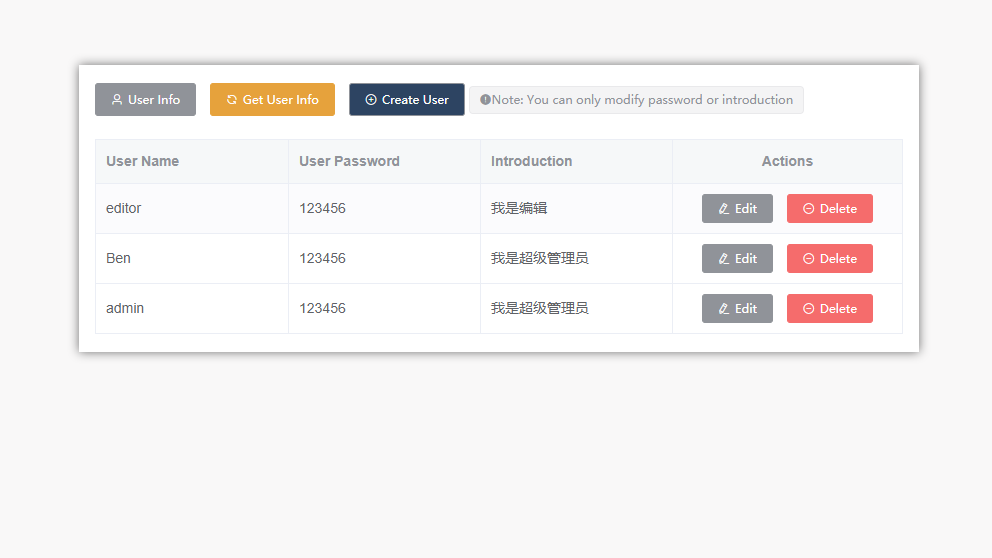
>
> > 1. Get User Info: 向服务器获取最新的用户列表
> >
> > 2. Create User： 创建新用户
> >
> >    > 用户名不允许与其他用户重名
> >    >
> >    > 创建后只允许修改密码和个人介绍
> >
> > 3. Delete按钮不允许删除自己 ：）
>
> UI Execution (Web-UI执行模块)
>
> > 1. Test Execute (测试执行)
> >
> >    > 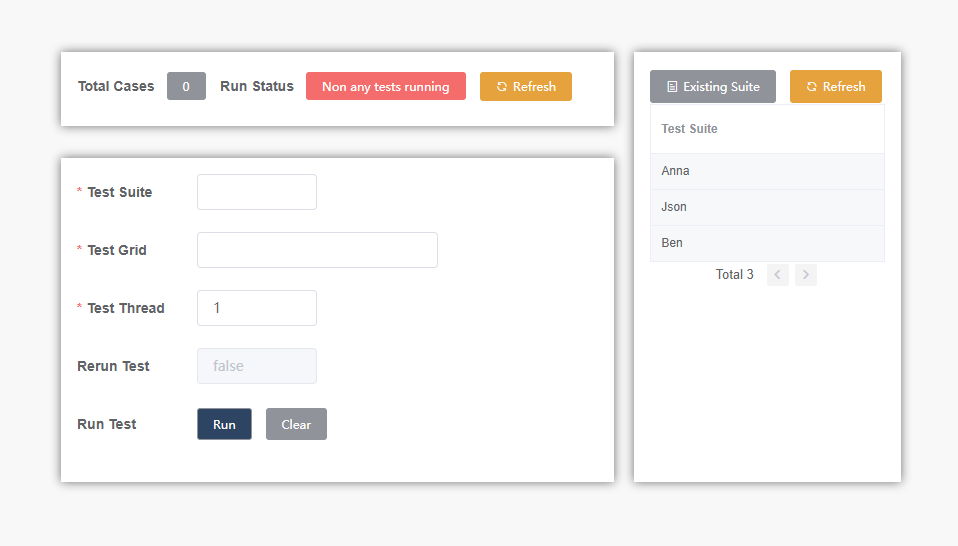
> >    >
> >    > > 测试用例运行情况（左上），当点击运行后测试用例总数和运行状态会更新：
> >    > >
> >    > > 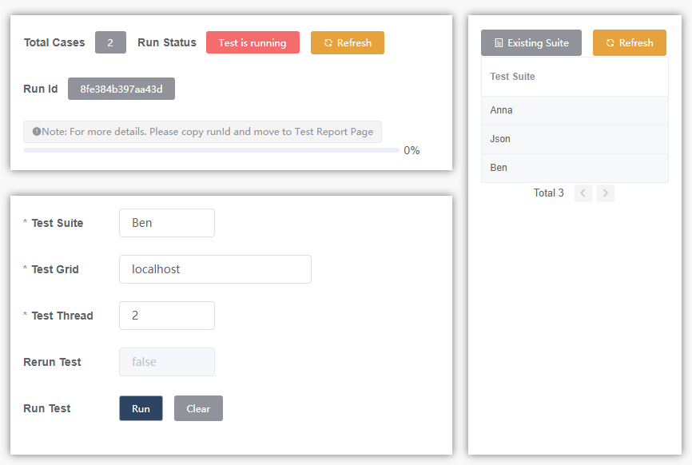
> >    > >
> >    > > > 运行后会生成RunId（它是你到Test Report页面查询详细报告的凭证），可点击RunId复制
> >    > >
> >    > > > 运行状态 ---> Non any test running ---> Test is running ---> Finished(进度条不会自动更新，需要点击Refresh按钮更新状态)
> >    > >
> >    > > 测试执行参数配置表（左下）
> >    > >
> >    > > > Test Suite: 是在Test Suite页面中已经创建好你想要运行的用例的集合，详细请移动Test Suite
> >    > > >
> >    > > > Test Grid: 是你需要把用例运行到哪个IP上（默认是localhost本机）的地址，不过前提是你需要在局域网中IP主机上配置并且启动一个selenium服务，请看以下配置方法（如果你想要用到selenium grid，请移步selenium官网学习，配置好Grid和Node，只需要在Test Grid中配置Grid的IP地址运行，就能实现Grid的自动分发到各个Node进行测试）：
> >    > > >
> >    > > > > 1. 下载 [selenium-server-standalone-3.14.0.jar](http://selenium-release.storage.googleapis.com/3.14/selenium-server-standalone-3.14.0.jar) 放进任何路径下的文件夹
> >    > > > >
> >    > > > > 2. 下载 http://npm.taobao.org/mirrors/chromedriver/78.0.3904.70/chromedriver_win32.zip 
> >    > > > >
> >    > > > > chromedriver与浏览器版本一一对应，下载前请看{浏览器版本号78.0.3904.70}放进上述路径下的文件夹
> >    > > > >
> >    > > > > 3. 当前文件夹创建txt文件打开输入:      
> >    > > > >
> >    > > > >    `java -Dwebdriver.chrome.driver=chromedriver.exe -jar selenium-server-standalon e-3.141.59.jar -host {你的IP地址或者localhost}                                  `    （端口号4444，端口号已经固定好，以后的版本会加入端口号的自定义），将txt文件改成bat文件（windowns用户，linux用户以后版本会更新），最后运行它就会出现以下日志状态，并且打开浏览器输入：http://{你的IP地址:4444}
> >    > > > >
> >    > > > > 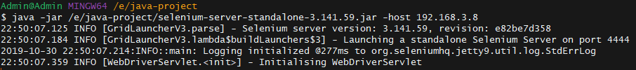
> >    > > > >
> >    > > > > 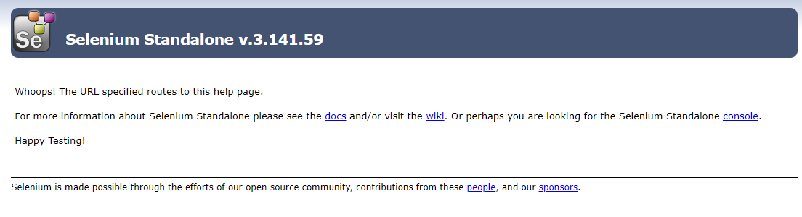
> >    > > > >
> >    > > > > 这样就配置成功啦！
> >    > > >
> >    > > > Test Thread：在测试集合中运行测试用例的并发数
> >    > > >
> >    > > > Rerun Test： 以后版本会更新：）
> >    > > >
> >    > > > Run 按钮： 运行并且覆盖当前所有状态信息，运行前必须保证你的Test Grid地址上启动了selenium服务，不然你会在测试报告中看到相关错误提示。
> >    > > >
> >    > > > Clear 按钮： 清空所有状态信息
> >    > >
> >    > > Existing Suite （右）是当前已经创建好的集合名字。
> >
> > 2. Test Report （测试报告）
> >
> >    > 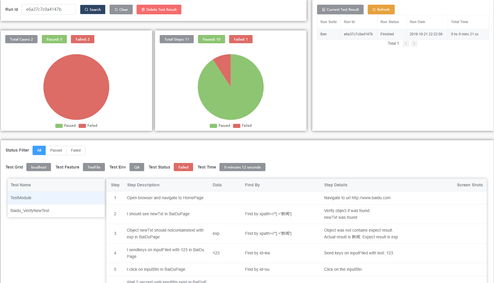
> >    >
> >    > RunId是在Test Execute中运行后生成的，当该测试未完成会在Current Test Report（右）上显示状态：In Process，完成后：Finished并且记录总共的测试时间
> >    >
> >    > 测试用例详细步骤（下）：步骤描述---步骤使用的数据---查找页面元素的方法---步骤失败截图
> >    >
> 
>UI Automation（测试用例-测试对象-测试数据-测试模块-测试集合的管理）
> 
>> 1. Test Case (测试用例)
> >
> >    >
> >    >
> >    >测试用例是一个或多个测试步骤的组合或者几个模块步骤的组合，在Test Case页面中，有以下功能点：
> >    >
> >    >>搜索、增加、编辑、删除测试用例
> >    >>
> >    >>这边详细讲下在Test Case中的Feature
> >    >>
> >    >>> 一个Feature代表一个功能模块，也是一个功能所有的测试用例的集合在指定的某个Test Suite中Feature不允许重复出现，但是它可以重复存放在不同的Test Suite中，包裹着相同或当中有不同或者全部不同的测试用例，按照不同公司的项目管理流程，它可以以你Story-ID命名，也可以是模块功能下子功能命名，亲，你定。还不清楚可以看看下图，下图只是一个关系结构图，与前端任何UI操作无关。
> >    >>>
> >    >>> 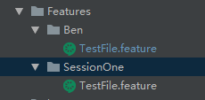
> >    >>
> >    >>这边详细讲下在Test Case中的Test Suite
> >    >>
> >    >>> 一个Test Suite代表一个测试集合，也是所有你将要测试的所有Feature中测试用例的一个集合，所以也代表一个敏捷项目模块（测试项目），大家要注意的是，它不是控制你将要运行哪些用例，而是仅仅只有存放测试用例的意义，与Test Suite页面的意义不同（Test Suite页面后面会讲），在上图的Ben和SessionOne文件夹就是存放测试用例的集合，但是如果需要在Test Suite页面中创建执行用例集合，必须和Test Case中的Test Suite名字相同，一个是存放用例一个是控制用例运行，所以他们是神话故事里的牛郎织女啊，不过中间没有隔着银河系。
> >    >>
> >    >>在Test Case中，它是按照BDD模式进行编写的，在这它就变成以自然语言的方式描述测试用例，一句一个步骤：表达式+描述语句。
> >    >>
> >    >>> Expression（表达式）：Given、Then、When、But、And，它们的意思顾名思义啊。
> >    >>>
> >    >>> Description (描述语句) ：
> >    >>>
> >    >>> > 这些描述语句翻译以下就能看到是什么意思，比如：
> >    >>>
> >    >>> > Open browser and navigate to homepage
> >    >>>
> >    >>> > 打开浏览器然后访问首页
> >    >>>
> >    >>> > Object {objectName} should notcontainstext with {text} in {pageName}
> >    >>>
> >    >>> > 对象{对象名字}应该不能包含字段{text}在页面{页面名字}
> >    >>>
> >    >>> 到这里，我想问下，这么翻译，能看懂它每一步骤都在做什么操作吗？要是不能，请告诉我，我优化下，我认错，我学习。
> >    >>>
> >    >>> 在编写测试用例之前，这里有个强制前置条件，是先去Test Data页面创建第一条对应的测试数据Data Name : URL, Data Value : {首页或者你要访问的页面}，如何创建测试数据移步Test Data页面。
> >    >>>
> >    >>> 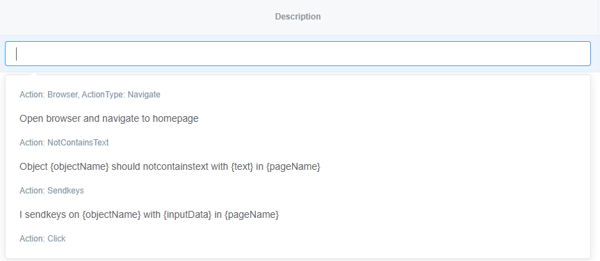
> >    >>>
> >    >>> 在上图中，可以看到带花括号{}字段，它们是可替换参数，替换它们时记得把花括号带走： 
> >    >>>
> >    >>> > objectName：是对象的名字，需要在Test Object页面创建。
> >    >>> >
> >    >>> > text/inputData/waitTime/optionText/storeName：是测试数据的名字或者测试数据，如果是测试数据的名字，需要在Test Data页面创建，如果不想创建，直接写上测试数据的值就好。
> >    >>> >
> >    >>> > pageName: 是页面名字，表示你的对象在哪个页面，在创建Test Object时必填。
> >    >>> >
> >    >>> > moduleName: 是一群测试步骤组成的模块的名字，需要在Test Module页面创建。
> >    >
> >    >Action Tips （右下）可参考所有语句的格式和语法
> >    >
> >    
> >2. Test Object (测试对象)
> > 
> >   > 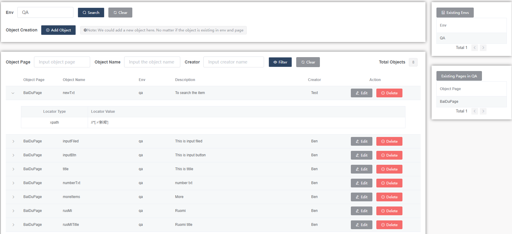
> >    >
> >    > 测试对象页面是管理各个页面的对象库，它借鉴了PageObject框架的理念
> >    >
> >    > ObjectPage：对象页面，对象会以页面划分
> >    >
> >    > ObjectName： 对象名字，同一对象页面中不允许重复出现
> >    >
> >    > env：环境，在开发项目中会有不同的程序环境，有测试的，有开发的还有上线的，这边我也做了分类，所以同一个case上的测试数据，测试对象，测试模块都要统一一个env
> >    >
> >    > 每个对象中有不同的定位方式：xpath/id/css等等，这个得看大家的基本功了，这里强调，必须把xpath和css搞熟了，对定位很有帮助。
> >    >
> >    
> > 3. Test Data （测试数据）
> >
> >    > 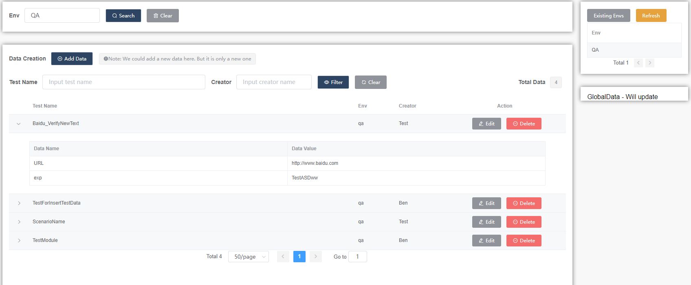
> >   >
> >    > 测试数据页面是管理每个case的初始化存储中心，以用例为单位，创建测试用例前必须创建测试数据
> >    >
> >    > Data Name是测试数据的键，通过键就能找到Data Value值
> >    >
> >    > 在Test Case中如果步骤需要用到测试数据，只需要替换成{text/inputData/waitTime/optionText/storeName}成键名（包括花括号），如果不需要引用测试数据，直接替换成测试数据的值。
> >    >
> >    
> > 4. Test Module （测试模块）
> > 
> >   > 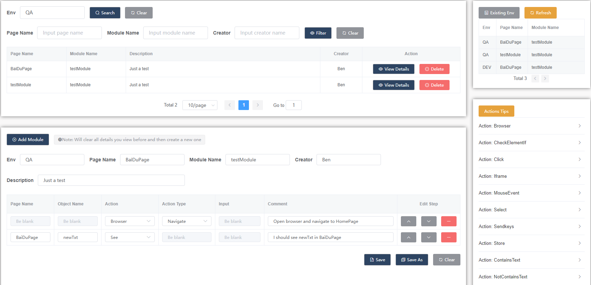
> >    >
> >   > 测试模块是一个一个测试步骤组成的集合，这里用到了关键字驱动的理念
> >    >
> >    > 【pageName】【objectName】【Action】【ActionType】【Input】【Comment】
> >    >
> >    > 它可以实现增删改查功能，那如何编写测试模块？
> >    >
> >    >    > 首先要先选Action下拉框，它已经包含了所有页面操作的动作
> >    >    >
> >    >    > 基于你选择的某行的Action，当前行的其他输入框或者下拉框会随之变化，我都已经做好了控制
> >    >    >
> >    >    > 所以你只需要创建测试对象，并且输入到当前行或者创建测试数据或者直接写测试数据的值在input
> >    >    >
> >    >    > Comment是必填项，用来描述你当前测试步骤，语言尽量通俗易懂
> >    >    >
> >    >    > 右下有Actions Tips参考
> >    >
> >    
> > 5. Test Suite （测试集合的管理）
> > 
> >    > 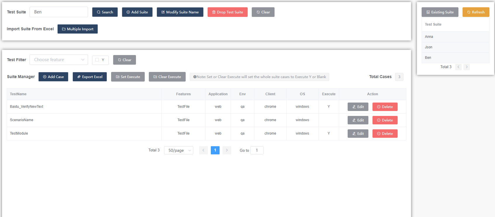
> >   >
> >    > 测试集合管理页面是控制测试用例是否运行的页面，与测试用例中的Test Suite不是一个东西，但是我说过如果需要在测试集合管理页面中创建集合，那必须和Test Case中的Test Suite名字相同，因为它们不同的地方是一个是存放用例一个是控制用例运行
> >   >
> >    > 【TestName】【Features】【Application】【Env】【Client】【OS】【Execute】
> >    >
> >    >    > TestName：与测试用例名字对应
> >    >    >
> >    >    > Features：与测试用例所属的Feature对应
> >    >    >
> >    >    > Env：就是环境，一个集合可以有多个不同环境的Env
> >    >    >
> >    >    > Application： web（以后会扩展mobile或者api）
> >    >    >
> >    >    > Client：浏览器（暂时只支持chrome，以后扩展mobile会是Android或者IOS，如果是API会默认api）
> >    >    >
> >    >    > OS：运行的客户端（这个参数，暂时就做摆设吧，以后一定会有用）
> >    >    >
> >    >    > Execute：控制用例是否运行，Y表示运行，空白表示不运行，当Test Execute中运行指定测试集合是只运行打上Y的测试用例
> >    >
> > 
> 

## 5、API Cook Book （烹饪菜式-2）

> API Execution (API执行模块)
>
> > 1.  API Execute (测试执行) 
> >
> >    > 与Web-UI执行模块差了一个Grid字段
> >    >
> >    > 
> >    >
> >    > 其他功能与Web-UI执行模块一致
> >
> > 2. API Report (测试报告）
> >
> >    > 与Web-UI测试报告模块增加了一个请求与响应的详细信息表格：
> >    >
> >    > 
> >    >
> >    > 其他功能与Web-UI测试报告模块一致
>
> API Automation （ 测试用例-测试数据-测试模块-测试集合的管理 ）
>
> > 1. API Case (API测试用例)
> >
> >    > 与UI-Test Case模块一致，只是Step Description会是API的部分， 在编写测试用例之前，这里有个强制前置条件，是先去API Data页面创建第一条对应的测试数据Data Name : host, Data Value : {你的host url}
> >    >
> >    > 
> >    >
> >    >  Action Tips （右下）可参考所有语句的格式和语法
> >
> > 2. API Module （API测试模块）
> >
> >    > 与UI-Test Module模块一致，只是模块的步骤组合缺少了Object Name和Page Name
> >    >
> >    > 
> >    >
> >    > 【Action】【ActionType】【Input】【Comment】
> >    >
> >    > 当你选择Action的时候，它会判断该Action是否有ActionType和Input的功能，这边都做了控制，包括你Save，Save As或者Submit的时候也会判断你写的对不对。
> >    >
> >    > 比如： 你选择了Query，但是在ActionType里面你选择了SetHeader，那么当你保存的时候会出现报错信息提醒。所以在你编写测试模块之前，请到右下有Actions Tips参考学习语法
> >
> > 3. API Data （API测试数据）
> >
> >    > 与UI-Test Data模块一致，只是每条测试用例的数据中多出以下数据输入框：
> >    >
> >    > 
> >    >
> >    > > Multiple Query Params
> >    > >
> >    > > > 是为你的url加入多个参数 ?{key}={value}，如果只需要加入一组参数可以选择直接加入到Data Name：{key}，Data Value：{value}中
> >    > > >
> >    > > > 
> >    > > >
> >    > > > 你也可以在Multiple Query Params中加入json串，这里需要注意的是每组Query的Key Name必须是带有query或者Query的字段
> >    > >
> >    > > Multiple Request Headers
> >    > >
> >    > > > 是为你的请求头加入多个参数，如果只需要加入一组参数可以选择直接加入到Data Name：{key}，Data Value：{value}中
> >    > > >
> >    > > > 你也可以在Multiple Request Headers中加入json串，这里需要注意的是每组Header的Key Name必须是带有header或者Header的字段
> >    > >
> >    > > Multiple Request Body Params
> >    > >
> >    > > > 是为你的请求body加入多个参数，如果只需要加入一组参数可以选择直接加入到Data Name：{key}，Data Value：{value}中
> >    > > >
> >    > > > 你也可以在Multiple Request Body Params中加入json串，这里需要注意的是每组Body的Key Name必须是带有body或者Body的字段
> >    > >
> >    > > Request File
> >    > >
> >    > > > 因为每个公司的项目的不同，所以该上传文件功能暂时需要不开放，如果有需要，请联系我。
> >
> > 4. API Test Suite
> >
> >    >与UI-Test Suite模块一致,只是需要配置的参数不一样：
> >    >
> >    >
> >    >
> >    >Application、Client都必须设置成api， OS参数暂时做摆设

## 6、联系方式

> QQ 群：517013705
>
> QQ： 573603568
>
> WeChat： bentaisir (注明加我的原因)
